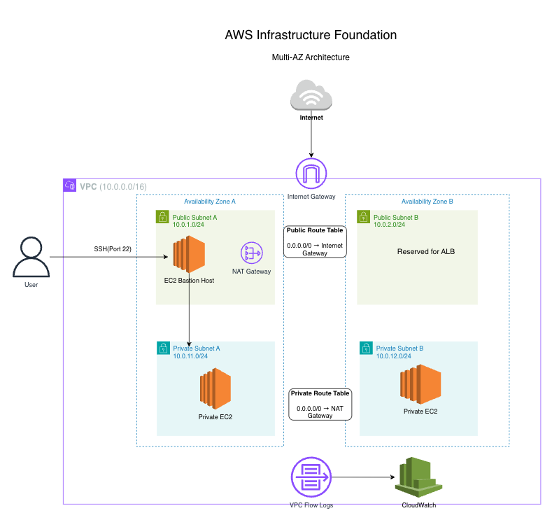
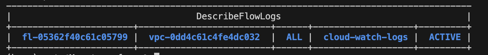

# AWS Infrastructure Foundation

I built this project to get a better understanding of how AWS networking works in a real environment.

I started by building the infrastructure manually in the AWS Console instead of jumping straight into Terraform. That helped me understand what each part was doing before I tried to automate it.

After the manual build was working, I documented the architecture, terminated the AWS resources to keep costs down, and started rebuilding the same environment with Terraform.

The project includes a custom VPC, public and private subnets across two Availability Zones, a Bastion Host, private EC2 instances, NAT Gateway, IAM roles, VPC Flow Logs, and CloudWatch.

---

## Project Status

* Manual AWS deployment completed
* Architecture diagram completed
* Terraform training completed through Digital Cloud Training
* Terraform rebuild tested successfully
* AWS resources destroyed after validation to control costs

---

## Architecture Diagram

The diagram below shows the current design for this project.



---

## Architecture Overview

The environment is built inside a custom VPC that spans two Availability Zones. Each Availability Zone has a public subnet and a private subnet.

The public side is where I placed resources that need controlled internet access, like the Bastion Host and NAT Gateway. The private side is where the EC2 instances live, without public IP addresses.

To reach a private instance, I connect to the bastion first, then hop into the private instance from inside the VPC. That setup helped me understand how access changes when an instance is not directly exposed to the internet.

The private instances use the NAT Gateway when they need outbound internet access, such as installing updates. They can reach out, but the internet cannot initiate connections directly back to them.

I also added VPC Flow Logs and sent them to CloudWatch so I could see more than just the final architecture diagram. I wanted some visibility into what was happening inside the network.

---

## Why I Built This

Passing the AWS Solutions Architect Associate exam gave me the concepts. What it did not give me was the confidence to build something in a real AWS account and trust that it would work the way I expected.

So I built this environment manually first. It was not the fastest path, but I wanted to see how routing, security groups, NAT, and subnet isolation behave when they are connected together.

The certification teaches what a NAT Gateway does. Misconfiguring one and watching a private instance lose internet access teaches it differently.

The Terraform rebuild came after the manual build. By then, I already knew what each resource was supposed to do, which made writing the Terraform code feel more like documenting the architecture instead of guessing.

---

## AWS Services Used

* Amazon VPC
* Public and Private Subnets
* Internet Gateway
* NAT Gateway
* Route Tables
* EC2
* Security Groups
* IAM Roles
* VPC Flow Logs
* CloudWatch

---

## Network Design

The VPC uses the CIDR block:

```text
10.0.0.0/16
```

The subnets are organized across two Availability Zones:

```text
Public Subnet A:   10.0.1.0/24
Public Subnet B:   10.0.2.0/24
Private Subnet A:  10.0.11.0/24
Private Subnet B:  10.0.12.0/24
```

The public route table sends internet-bound traffic to the Internet Gateway.

```text
0.0.0.0/0 → Internet Gateway
```

The private route table sends outbound internet traffic through the NAT Gateway.

```text
0.0.0.0/0 → NAT Gateway
```

This keeps private EC2 instances protected from direct internet access while still allowing outbound connectivity when needed.

---

## Security Design

The private EC2 instances do not have public IP addresses. Access is controlled through a Bastion Host located in the public subnet.

The security group design follows a simple pattern:

* Allow SSH to the Bastion Host from an approved source
* Allow SSH to private EC2 instances only from the Bastion Host
* Avoid exposing private instances directly to the internet

IAM roles are used for EC2 permissions instead of placing long-term credentials on the instances.

---

## Monitoring and Logging

VPC Flow Logs are included to capture network traffic metadata inside the VPC.

I sent the logs to CloudWatch so I could actually see what was moving through the environment and use it for troubleshooting. This helped me understand how visibility fits into infrastructure design, especially from a security and operations perspective.

---

## Design Decisions

### Bastion Host for Private Access

I used a Bastion Host to control administrative access into the private subnet.

This made the access path easier to understand because I could see the connection flow from my machine, to the bastion, and then into the private instance.

A stronger production option would be AWS Systems Manager Session Manager, which can reduce or remove the need for SSH access. I kept the Bastion Host in this project because it helped me learn the networking and security group behavior more clearly.

---

### Private EC2 Instances Across Two Availability Zones

The architecture includes private EC2 instances across two Availability Zones to demonstrate multi-AZ subnet design.

This does not make the application highly available by itself. A true high-availability design would also include services like an Application Load Balancer and Auto Scaling.

For this project, the goal was to understand the network foundation first.

---

### Public Subnet B Reserved for Future ALB

Public Subnet B is reserved for a future Application Load Balancer.

I did not add the ALB in this phase because the focus of this project is the network foundation, access control, monitoring, and Terraform rebuild. Reserving space for the ALB shows how the architecture could grow later without redesigning the VPC.

---

## Trade-Offs Considered

### Single NAT Gateway

This project uses one NAT Gateway to keep the design simpler and reduce costs.

A more resilient production design would use one NAT Gateway per Availability Zone. That would reduce cross-AZ dependency, but it would also increase cost.

For this project, one NAT Gateway was enough to practice private subnet outbound internet access while staying cost-conscious.

---

### Bastion Host vs Session Manager

A Bastion Host makes SSH access easier to visualize and troubleshoot, especially while learning AWS networking.

The trade-off is that it introduces another EC2 instance to manage and secure.

AWS Systems Manager Session Manager would be a better long-term option because it can provide access without opening SSH ports, but I chose the Bastion Host pattern first to understand the underlying network flow.

---

## Break / Fix Exercises

Not everything worked on the first try, and that was the point.

The route table issue was the most useful one. My private instance could not reach the internet, and my first instinct was to check the NAT Gateway itself. The NAT Gateway looked fine. The actual problem was that the private route table was not pointing to it.

The fix was simple once I found it, but the lesson stuck: a NAT Gateway does not help a subnet unless the subnet is actually routed through it.

SSH access also failed when I tried to connect from the Bastion Host into the private instance. The bastion connection worked, but the hop into the private instance did not. The issue was the private instance security group. It needed to allow SSH from the Bastion Host security group, not from a random public IP.

Switching to security group referencing made the setup cleaner and more secure.

I documented these issues because being able to explain what broke and why is just as important as showing the final working architecture.

---

## What I Learned

The biggest shift was realizing that a subnet is not public or private because of what I name it. It is public or private because of what its route table points to.

That sounds obvious now, but it clicked when I was looking at a broken environment and trying to figure out why traffic was not flowing the way I expected.

Building manually before writing Terraform also changed how I think about Infrastructure as Code. When I already know what each resource does and how the pieces connect, the Terraform code makes sense. Without that understanding, it is easy to just copy blocks and hope they work.

The VPC Flow Logs piece was also important. Building the network is one part of the project, but adding visibility is what makes it feel closer to real operations. That is something I want to carry into future projects, especially as I move toward cloud security work.

---

## Terraform Rebuild

After completing Terraform training, I rebuilt this architecture using Infrastructure as Code.

The Terraform configuration now recreates the main pieces of the environment:

- VPC
- Public and private subnets across two Availability Zones
- Internet Gateway
- Route tables
- NAT Gateway
- Security groups
- Bastion Host
- Private EC2 instances
- IAM role and instance profile for EC2
- VPC Flow Logs
- CloudWatch Log Group for flow log storage

I tested the rebuild by running Terraform locally through the full workflow:

```text
terraform init
terraform validate
terraform plan
terraform apply
terraform destroy
```

Terraform successfully created the infrastructure, and I destroyed the resources afterward to avoid unnecessary AWS costs.

This was an important step because it proved the project was not just documented in GitHub. The architecture could actually be recreated from code.

---

## Validation Evidence

The screenshot below shows the successful Terraform apply from the local rebuild test.


The screenshot below shows the VPC Flow Log active and sending traffic metadata to CloudWatch Logs.



After confirming the resources were created and the VPC Flow Log was active, I destroyed the environment to avoid ongoing AWS costs.

---

## Future Improvements

A few things I'd change for a production environment:

The first improvement would be replacing the Bastion Host with AWS Systems Manager Session Manager. That would reduce the need for SSH access and remove the need to manage a jump box.

I would also add an Application Load Balancer and Auto Scaling Group if this environment needed to support a real application. The current design uses multiple subnets across two Availability Zones, but it does not include load balancing or automatic instance replacement yet.

For monitoring, I would add CloudWatch metric filters, alarms, and a small dashboard so the VPC Flow Logs are easier to review during troubleshooting.

The next project will build on this by focusing more directly on AWS security monitoring, including CloudTrail, GuardDuty, AWS Config, SNS alerts, and security findings documentation.