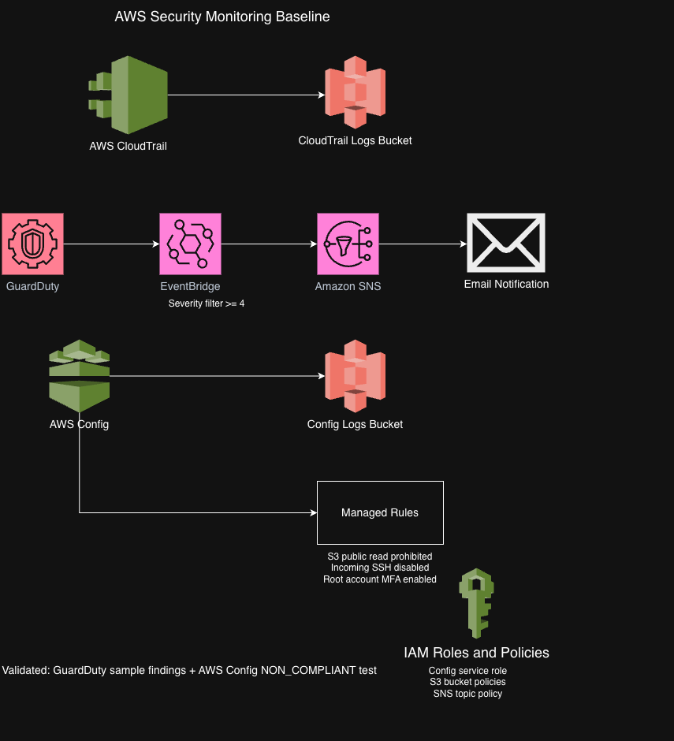
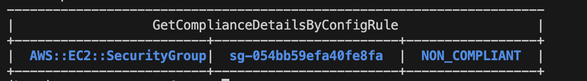

# AWS Security Monitoring Baseline

## Business Scenario

Organizations running cloud infrastructure often have no real-time visibility into suspicious account activity or risky configuration changes — issues surface during an audit or after an incident, not before. This project addresses that gap by building a baseline monitoring and alerting pipeline that continuously detects threats and configuration drift instead of relying on periodic manual review.

## Project Goal

This is the follow-up to my networking project, which focused on building the environment — VPC, subnets, Terraform, NAT Gateway, bastion access, and VPC Flow Logs. This project builds a foundational AWS account security monitoring baseline using CloudTrail, GuardDuty, AWS Config, EventBridge, SNS, Amazon S3, and IAM — logging account activity, detecting suspicious behavior, catching risky configurations, and sending alerts when something needs attention.

## Project Status

- Project folder created
- Terraform base files created
- CloudTrail logging baseline completed
- CloudTrail log file validation enabled
- GuardDuty detector enabled
- EventBridge rule created for GuardDuty findings
- SNS topic created for security alerts
- Email subscription confirmed manually
- GuardDuty sample findings generated to validate alert delivery
- EventBridge severity filter added for medium and higher severity findings
- AWS Config recorder enabled
- AWS Config managed rules added
- AWS Config non-compliance validation completed
- Security runbook added

## AWS Services Used

- AWS CloudTrail
- Amazon S3
- Amazon GuardDuty
- Amazon EventBridge
- Amazon SNS
- AWS Config
- IAM

## Architecture Overview

This project creates a basic AWS account security monitoring baseline.

The main monitoring flows are:

- CloudTrail records AWS account activity and stores logs in a secured S3 bucket.
- GuardDuty monitors the account for suspicious activity.
- EventBridge filters GuardDuty findings by severity and sends medium and higher severity findings to SNS.
- SNS sends email alerts for findings that need faster attention.
- AWS Config records resource configuration changes and checks resources against managed compliance rules.
- IAM roles and policies allow AWS services to deliver logs, record configurations, and publish alerts without using broad admin-style permissions.

The security runbook documents how I validated the alerting path, how I would triage real findings, what evidence I would check, and what limitations still exist in this version.

## Architecture Diagram

## CloudTrail Logging Baseline

The first phase of this project sets up CloudTrail logging for the AWS account.

CloudTrail records account activity and sends the logs to a secured S3 bucket. The bucket has public access blocked, server-side encryption using SSE-S3 enabled, and versioning turned on.

I also enabled CloudTrail log file validation. This helps verify that log files were not changed after CloudTrail delivered them to S3.

The trail is configured as a multi-region trail so activity from multiple AWS regions can be captured.

## GuardDuty Alerting Pipeline

The second phase of this project adds threat detection and alerting.

GuardDuty creates findings when it detects suspicious activity in the AWS account. I used EventBridge as the routing layer because GuardDuty findings are emitted as EventBridge events, and EventBridge gives me a place to filter or route findings before sending them to SNS.

I tested the alert path by generating GuardDuty sample findings. The test confirmed that GuardDuty findings were routed through EventBridge and delivered through SNS email alerts.

The first version routed all GuardDuty findings to SNS. That worked for validation, but it created too much alert noise during testing.

I updated the EventBridge rule to send findings with severity greater than or equal to 4 to SNS. That keeps the email path focused on medium and higher severity findings.

In this version, low-severity findings are not sent to email. A stronger production version would route lower-severity findings somewhere less noisy, such as CloudWatch Logs or an S3 archive, so they can still be reviewed without creating inbox noise.

I did not include a screenshot of the SNS subscription because it shows my email address and AWS account-specific ARN details. For public documentation, I included the GuardDuty detector validation and EventBridge severity filter screenshots instead.

## AWS Config Compliance Monitoring

The third phase of this project adds AWS Config for configuration monitoring.

AWS Config records supported resource configurations and evaluates them against managed rules. I added a configuration recorder, delivery channel, secured S3 bucket for Config logs, and three managed rules.

The managed rules currently check for:

- S3 buckets that allow public read access
- Security groups that allow unrestricted SSH access
- Whether MFA is enabled for the AWS root account

I validated the setup in two ways. First, I confirmed that the Config recorder was running successfully and that the managed rules were created.

Then I created a temporary security group that allowed SSH from `0.0.0.0/0` so I could test whether the `INCOMING_SSH_DISABLED` managed rule would catch it. AWS Config marked the security group as `NON_COMPLIANT`, which confirmed that the rule was evaluating resources as expected.

After the test, I removed the open SSH rule and deleted the temporary security group.

## IAM and Permissions

IAM is part of this project because the monitoring services need permission to record activity, deliver logs, and publish alerts.

For AWS Config, I created a service role that allows Config to record supported AWS resources and evaluate them against managed rules.

For CloudTrail and AWS Config log delivery, I used S3 bucket policies that allow the AWS service principals to write logs only to the dedicated log buckets for this project.

For EventBridge and SNS, I used an SNS topic policy that allows EventBridge to publish GuardDuty findings to the security alerts topic.

The permissions are scoped to the specific bucket, topic, or AWS service role used in this project. I did not add `aws:SourceArn` or `aws:SourceAccount` conditions to the bucket policies in this version, so I am treating that as a hardening improvement for a later pass rather than claiming it is already handled.

## Design Decisions & Trade-Offs

**EventBridge between GuardDuty and SNS**
I used EventBridge as the routing layer because it lets me filter, enrich, or redirect findings before they reach notification systems, keeping the architecture flexible as monitoring grows.

**Medium-and-higher severity alerts only**
Initially every GuardDuty finding generated an email. That created unnecessary noise, so I changed the rule to notify only for medium and higher severity findings, leaving lower-severity findings available for review elsewhere.

**AWS Config validation, not assumption**
Rather than assuming the managed rules worked, I intentionally introduced an unrestricted SSH rule and confirmed AWS Config marked it as `NON_COMPLIANT` before removing it.

## How to Deploy

This project is deployed with Terraform.

From the Terraform folder, run:

    cd 02-aws-security-monitoring/terraform
    terraform init
    terraform plan -var-file="terraform.tfvars"
    terraform apply -var-file="terraform.tfvars"

The `terraform.tfvars` file is used for local values such as the alert email address. It is intentionally not committed to GitHub.

Example:

    alert_email = "your-email@example.com"

After applying, the SNS email subscription must be confirmed manually from the email inbox before alerts can be delivered.

## Validation Commands

These are the main validation commands I used during the project.

Check CloudTrail:

    aws cloudtrail describe-trails \
      --region us-east-1 \
      --query "trailList[*].[Name,S3BucketName,IsMultiRegionTrail,LogFileValidationEnabled]" \
      --output table

Check GuardDuty:

    aws guardduty list-detectors \
      --region us-east-1 \
      --output table

Check AWS Config recorder status:

    aws configservice describe-configuration-recorder-status \
      --region us-east-1 \
      --query "ConfigurationRecordersStatus[*].[name,recording,lastStatus]" \
      --output table

Check AWS Config rules:

    aws configservice describe-config-rules \
      --region us-east-1 \
      --query "ConfigRules[*].[ConfigRuleName,Source.SourceIdentifier]" \
      --output table

Check for non-compliant SSH security groups:

    aws configservice get-compliance-details-by-config-rule \
      --config-rule-name security-monitoring-incoming-ssh-disabled \
      --compliance-types NON_COMPLIANT \
      --region us-east-1 \
      --query "EvaluationResults[*].[EvaluationResultIdentifier.EvaluationResultQualifier.ResourceType,EvaluationResultIdentifier.EvaluationResultQualifier.ResourceId,ComplianceType]" \
      --output table

## Cleanup

To remove the Terraform-managed resources:

    terraform destroy -var-file="terraform.tfvars"

During cleanup, the CloudTrail and AWS Config S3 buckets may need extra attention because versioning is enabled. If the buckets contain object versions or delete markers, Terraform may not be able to delete them until those versions are removed.

That happened during this project, and I documented the cleanup lesson in the security runbook.

## Security Runbook

I added a security runbook to document how I validated the monitoring setup and how I would respond to findings.

The runbook covers:

- GuardDuty sample finding validation
- Severity filtering decisions
- EventBridge rule pattern
- Real finding triage process
- CloudTrail review process
- AWS Config compliance review
- Current limitations and future improvements

Runbook: [Security Monitoring Runbook](docs/security-runbook.md)

## What I'd Do Differently in Production

For a production deployment, I'd make several improvements:

- Add AWS Security Hub to centralize findings from multiple AWS security services.
- Archive lower-severity GuardDuty findings instead of dropping them from email notifications.
- Harden S3 bucket policies with `aws:SourceArn` and `aws:SourceAccount` conditions.
- Forward CloudTrail and GuardDuty findings into a SIEM platform for centralized investigation.
- Expand the AWS Config managed rules to cover additional security and compliance controls.

## Why I Built This

Rather than just detecting security findings, I wanted to understand how to validate a monitoring pipeline end to end, investigate what a finding actually means, and document a response process — the operational side of cloud security that a certification exam doesn't test.
