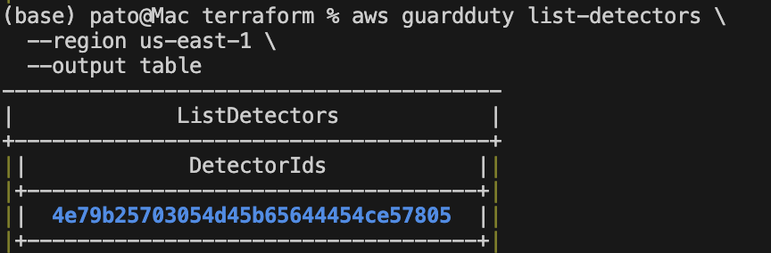
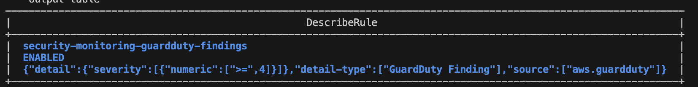
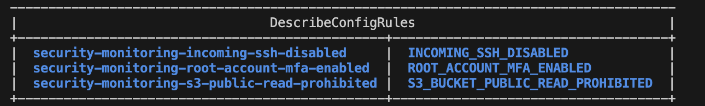

# AWS Security Monitoring Baseline

This is the follow-up to my networking project. That project was about building the environment: VPC, subnets, Terraform, NAT Gateway, bastion access, and VPC Flow Logs. This one is about monitoring what happens inside an AWS account.

I’m setting up a basic account monitoring baseline using CloudTrail, GuardDuty, AWS Config, SNS, EventBridge, and CloudWatch. The goal is to log account activity, detect suspicious behavior, catch risky configurations, and send alerts when something needs attention.

## Project Status

- Project folder created
- Terraform base files created
- CloudTrail logging baseline completed
- CloudTrail log file validation enabled
- GuardDuty detector enabled
- EventBridge rule created for GuardDuty findings
- SNS topic created for security alerts
- Email subscription confirmed manually
- GuardDuty sample findings generated to validate alert delivery
- EventBridge severity filter added for medium and high severity findings
- AWS Config recorder enabled
- AWS Config managed rules added
- Security runbook still to come

## Planned AWS Services

- AWS CloudTrail
- Amazon S3
- Amazon GuardDuty
- Amazon SNS
- Amazon EventBridge
- AWS Config
- Amazon CloudWatch
- IAM

## Architecture Overview

CloudTrail logs account activity and sends the logs to a secured S3 bucket.

GuardDuty is enabled for threat detection.

EventBridge routes medium and high severity GuardDuty findings to an SNS topic for email alerts.

AWS Config checks for configuration issues like public S3 buckets, unrestricted SSH access, and root account MFA.

I’m also writing a security runbook alongside this project: how I would triage a finding, what I would check first, and what remediation might look like. Not because anyone is asking for it, but because “I’d know what to do” is not the same as having it written down.

## CloudTrail Logging Baseline

The first phase of this project sets up CloudTrail logging for the AWS account.

CloudTrail records account activity and sends the logs to a secured S3 bucket. The bucket has public access blocked, server-side encryption enabled, and versioning turned on.

I also enabled CloudTrail log file validation. This helps verify that log files were not changed after CloudTrail delivered them to S3.

The trail is configured as a multi-region trail so activity from multiple AWS regions can be captured.

## GuardDuty Alerting Pipeline

The second phase of this project adds threat detection and alerting.

GuardDuty creates findings when it detects suspicious activity in the AWS account. I used EventBridge as the routing layer because GuardDuty findings are emitted as EventBridge events, and EventBridge gives me a place to filter or route findings before sending them to SNS.

I tested the alert path by generating GuardDuty sample findings. The test confirmed that GuardDuty findings were routed through EventBridge and delivered through SNS email alerts.

The first version routed all GuardDuty findings to SNS. That worked for validation, but it created too much alert noise during testing.

I updated the EventBridge rule to only send medium and high severity findings to SNS by filtering for findings with severity greater than or equal to 4.

In this version, low-severity findings are not sent to email. A stronger production version would route lower-severity findings somewhere less noisy, such as CloudWatch Logs or an S3 archive, so they can still be reviewed without creating inbox noise.

I did not include a screenshot of the SNS subscription because it shows my email address and AWS account-specific ARN details. For public documentation, I included the GuardDuty detector validation and EventBridge severity filter screenshots instead.

## AWS Config Compliance Monitoring

The third phase of this project adds AWS Config for configuration monitoring.

AWS Config records supported resource configurations and evaluates them against managed rules. I added a configuration recorder, delivery channel, secured S3 bucket for Config logs, and three managed rules.

The managed rules currently check for:

- S3 buckets that allow public read access
- Security groups that allow unrestricted SSH access
- Whether MFA is enabled for the AWS root account

I validated the setup by confirming the Config recorder was running successfully and that the managed rules were created.

## Why I Built This

The networking project was about building infrastructure. This project is about knowing what is happening inside the AWS account.

It is not enough to have a clean VPC if I cannot tell who changed something, whether GuardDuty flagged an issue, or if a security group is open to the internet and I have not noticed yet.

That is the gap this project is meant to close: using AWS security tooling to answer those questions instead of just knowing the theory.